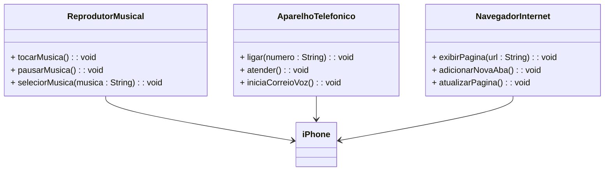

# Diagrama UML

```mermaid
classDiagram
    class ReprodutorMusical {
      + tocarMusica( ) : void
      + pausarMusica( ) : void
      + seleciorMusica (musica : String) : void 
    }

    class AparelhoTelefonico {
      + ligar(numero : String) : void
      + atender( ) : void
      + iniciaCorreioVoz( ) : void
    }

    class NavegadorInternet {
      + exibirPagina (url : String) : void
      + adicionarNovaAba ( ) : void
      + atualizarPagina ( ) : void
    }

    class iPhone {
    }

    ReprodutorMusical --> iPhone 
    AparelhoTelefonico --> iPhone 
    NavegadorInternet --> iPhone
```
